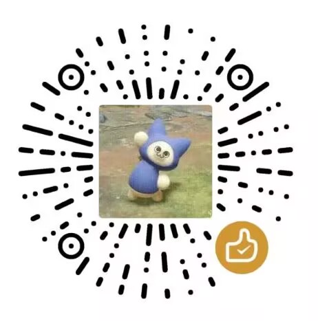

# QiangQiang (强强)

**English** | [中文](README.md) | [LinuxDO](https://linux.do)

<a href="https://paypal.me/koboling"></a>

<details>
<summary>WeChat Sponsor</summary>

</details>

Ultra-lightweight Windows desktop app framework. C++ Win32 + WebView2 + Bun + TypeScript.

> **638KB** exe. 66 native APIs. Zero runtime dependencies (WebView2 is built into Windows 10/11).

## Features

- **Tiny** — 638KB exe, ~650KB total distributable
- **Fast build** — Single-file C++, incremental compile < 2s
- **Full API** — 66 native commands + event system + full TypeScript types
- **Frameless window** — DWM shadow + custom titlebar + native resize
- **Hot reload** — `bun run dev` for instant frontend refresh
- **Zero deps** — No Node.js, Electron, or Tauri needed
- **Any frontend** — Use any framework: React / Vue / Svelte / Solid / vanilla TS — anything that outputs HTML/CSS/JS
- **Windows-only** — Dedicated to Windows, direct Win32 API access

## Quick Start

### Prerequisites

- [Bun](https://bun.sh) — Frontend build tool & scripts
- [Visual Studio Build Tools 2022](https://visualstudio.microsoft.com/downloads/#build-tools-for-visual-studio-2022) — C++ compiler (select "Desktop development with C++")

### Install

```bash
bun install
bun run setup    # Downloads WebView2 SDK + JSON library
```

### Develop

```bash
bun run dev      # Hot-reload dev mode (F12 opens DevTools)
```

### Build

```bash
bun run build    # Compiles to dist/
```

### Package

```bash
bun run package  # Creates release/强强-portable.zip
```

## API Overview

### Window Management (16 commands + 9 events)

```typescript
import { win } from './api';

await win.setTitle('My App');
await win.setSize(1280, 720);
await win.center();
await win.maximize();
await win.setAlwaysOnTop(true);
await win.startDrag();  // Custom titlebar dragging

// Event listeners
win.onResized(({ w, h }) => console.log(`${w}×${h}`));
win.onFocus(() => console.log('focused'));
win.onFileDrop(({ files }) => console.log('dropped:', files));
```

### Dialogs (5 commands)

```typescript
import { dialog } from './api';

const path = await dialog.openFile({
    filters: [{ name: 'Images', extensions: ['png', 'jpg'] }],
    multiple: true
});
const savePath = await dialog.saveFile({ defaultName: 'output.txt' });
const ok = await dialog.confirm('Confirm', 'Continue?');
```

### File System (8 commands)

```typescript
import { fs } from './api';

const content = await fs.readTextFile('C:\\data\\config.json');
await fs.writeTextFile('C:\\data\\output.txt', 'Hello');
const entries = await fs.readDir('C:\\Users');
const stat = await fs.stat('C:\\Windows\\notepad.exe');
```

### HTTP Client (bypasses CORS)

```typescript
import { http } from './api';

const res = await http.get('https://api.github.com/repos/user/repo');
console.log(JSON.parse(res.body));

const res2 = await http.post('https://httpbin.org/post',
    JSON.stringify({ key: 'value' }),
    { 'Content-Type': 'application/json' }
);
```

### Global Hotkeys

```typescript
import { hotkey, MOD, VK } from './api';

await hotkey.register(1, MOD.CONTROL | MOD.SHIFT, VK.A);
hotkey.onTriggered(({ id }) => {
    if (id === 1) console.log('Ctrl+Shift+A triggered!');
});
```

### Context Menu

```typescript
import { menu } from './api';

const idx = await menu.popup([
    { label: 'Copy' },
    { label: 'Paste' },
    '-',  // separator
    { label: 'Delete', disabled: true },
]);
if (idx === 0) { /* copy */ }
```

### System Tray

```typescript
import { tray, menu, app, win } from './api';

await tray.create('My App');
tray.onClick(() => win.show());
tray.onRightClick(async () => {
    const idx = await menu.popup([
        { label: 'Show' },
        { label: 'Quit' },
    ]);
    if (idx === 1) app.exit();
});
```

### Notifications

```typescript
import { notification } from './api';

await notification.show('Download Complete', 'File saved to desktop');
```

### File Watcher

```typescript
import { watcher } from './api';

const id = await watcher.start('C:\\my-project\\src');
watcher.onChange(({ action, path }) => {
    console.log(`${action}: ${path}`);
});
await watcher.stop(id);
```

### More APIs

```typescript
import { os, path, env, clipboard, shell, devtools } from './api';

// System info
await os.version();   // "10.0.22631"
await os.hostname();  // "MY-PC"
await os.username();  // "admin"
await os.locale();    // "zh-CN"

// Special directories
await path.home();       // "C:\Users\admin"
await path.documents();  // "C:\Users\admin\Documents"
await path.downloads();  // "C:\Users\admin\Downloads"
await path.temp();       // temp directory

// Environment variables
await env.get('PATH');
await env.getAll();

// Clipboard
await clipboard.writeText('Hello!');
const text = await clipboard.readText();

// Shell
await shell.open('https://github.com');
await shell.execute('notepad.exe', ['file.txt']);

// DevTools (dev mode only)
await devtools.open();
```

## Configuration

`app.config.json`:

```json
{
    "window": {
        "title": "My App",
        "width": 1024,
        "height": 768,
        "minWidth": 400,
        "minHeight": 300,
        "frameless": true,
        "titleBarHeight": 40,
        "borderSize": 6,
        "backgroundColor": "#1a1a2e",
        "singleInstance": true
    },
    "dev": {
        "port": 3000
    }
}
```

## Project Structure

```
├── native/
│   ├── main.cpp        # C++ shell (~1000 lines)
│   ├── app.rc          # Resource file
│   └── app.ico         # App icon (replace to customize)
├── src/
│   ├── ipc.ts          # IPC communication bridge
│   ├── api.ts          # TypeScript wrappers for all 66 commands
│   ├── main.ts         # Demo frontend
│   └── index.html      # Entry page
├── scripts/
│   ├── setup.ts        # Download dependencies
│   ├── build.ts        # Build frontend + native shell
│   ├── dev.ts          # Dev server + hot reload
│   └── package.ts      # Package for distribution
├── app.config.json     # App configuration
└── package.json
```

## IPC Protocol

Frontend communicates with the native shell via `window.chrome.webview.postMessage`:

```
Request:  { id: number, cmd: string, args: object }
Response: { id: number, result: any } | { id: number, error: string }
Event:    { event: string, data: any }
```

## All Commands (66)

| Category | Commands |
|---|---|
| **Window** | `setTitle` `minimize` `maximize` `restore` `close` `show` `hide` `size` `setSize` `position` `setPosition` `center` `setAlwaysOnTop` `isMaximized` `startDrag` `isFrameless` |
| **Window Config** | `getConfig` `saveState` `loadState` |
| **Dialogs** | `openFile` `saveFile` `openFolder` `message` `confirm` |
| **File System** | `readTextFile` `writeTextFile` `exists` `readDir` `mkdir` `remove` `rename` `stat` |
| **Clipboard** | `readText` `writeText` |
| **Shell** | `open` `execute` |
| **App** | `exit` `dataDir` |
| **Tray** | `create` `setTooltip` `remove` |
| **Environment** | `get` `getAll` |
| **Hotkeys** | `register` `unregister` `unregisterAll` |
| **Notification** | `show` |
| **Menu** | `popup` |
| **HTTP** | `request` |
| **OS** | `platform` `arch` `version` `hostname` `username` `locale` |
| **Paths** | `home` `documents` `desktop` `downloads` `appData` `localAppData` `temp` |
| **Watcher** | `start` `stop` |
| **DevTools** | `open` `close` |

## Events (14)

| Event | Data | Description |
|---|---|---|
| `window.focus` | — | Window gained focus |
| `window.blur` | — | Window lost focus |
| `window.maximized` | — | Window maximized |
| `window.minimized` | — | Window minimized |
| `window.restored` | — | Window restored |
| `window.resized` | `{ w, h }` | Window resized |
| `window.moved` | `{ x, y }` | Window moved |
| `window.closing` | — | Window about to close |
| `window.fileDrop` | `{ files, x, y }` | Files dropped onto window |
| `hotkey.triggered` | `{ id }` | Global hotkey triggered |
| `watcher.changed` | `{ id, action, path }` | File system change |
| `tray.click` | — | Tray icon clicked |
| `tray.doubleClick` | — | Tray icon double-clicked |
| `tray.rightClick` | — | Tray icon right-clicked |

## Custom Icon

Replace `native/app.ico` with your icon file and rebuild with `bun run build`.

Recommended sizes: 16×16, 32×32, 48×48, 256×256.

## Comparison

| | QiangQiang | Electron | Tauri |
|---|---|---|---|
| Exe size | **638 KB** | ~120 MB | ~2 MB |
| Memory | ~30 MB | ~150 MB | ~40 MB |
| Build time | ~2s | N/A | ~10s |
| Cross-platform | Windows only | ✓ | ✓ |
| Frontend freedom | Full | Full | Full |
| Native APIs | 66 | ~50+ | ~70+ |

## License

MIT
